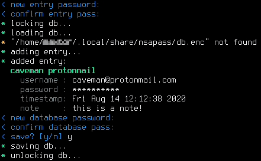
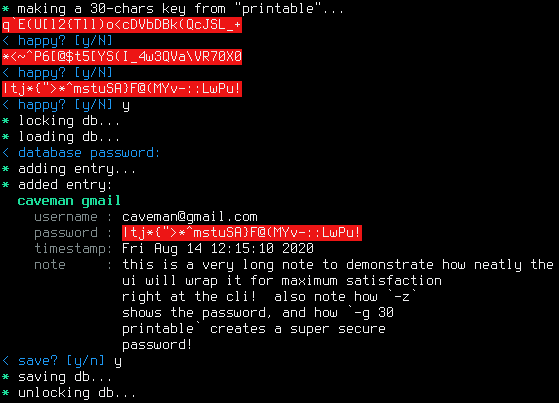
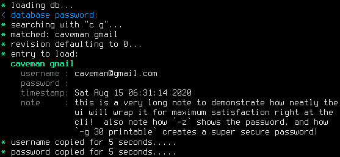
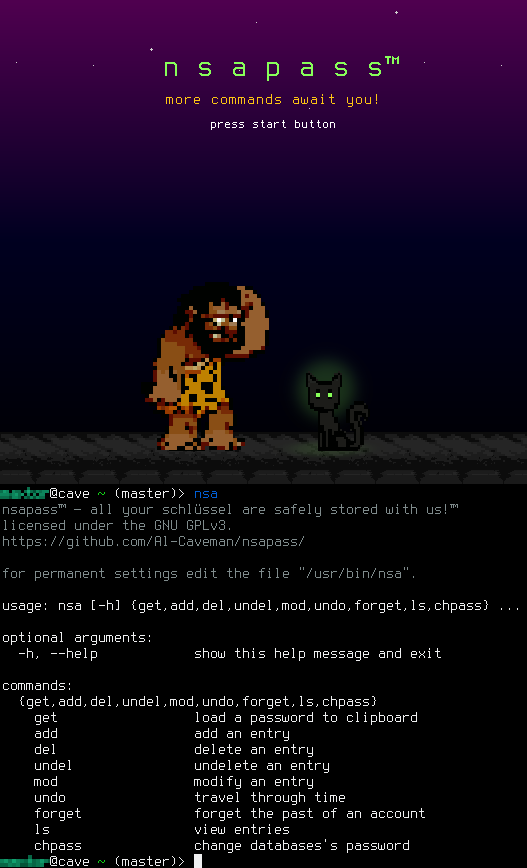

# what is nsapass?
nsapass is the name of the project which makes an executable named `nsa`,
which (the latter) is the simplest, most secure, passwords manager that i
know of, for these reasons:

- **minimum segfaults and funny bugs:**  written _entirely_ in python.  you
  can be pretty sure that undefined behaviour due to improper memory access
  is _pretty_ minimum.  in a sense nsapass takes advantage of the _many_
  highly skilled python monkeys to ensure that this app does not have funny
  memory bugs.

  sensitive parts concerning encryption, decryption or access to clipboard,
  is entirely offloaded into other external apps of your choice in the
  _true_ spirit of the UNIX philosophy!  by default, the configuration
  makes a _great_ choice by using `scrypt` for encryption and decryption.
  `scrypt` is _super_ hard to bruteforce and other attacks!

- **super _ultra_ easy to audit:**  written in a _single_ python script
  made of _only_ about ~`600` lines of code!  no separate config file, so
  those approx ~`600` lines of code include the configs!  the configs are
  done in a _sucklessy_ kind of approach where you edit some variables in
  the nsapass file itself.

  the passwords database itself is a simple json text file!  of course,
  this entire json file is encrypted, but thanks to the _extreme_
  simplicity of this, you may decrypt it manually to see by _yourself_ how
  simple and awesome and _occam-razory_ this is!

- **common sense:** your passwords database never touches the disk in plain
  text form.  i know this is common sense, but i just listed it in case it
  helps lowering your resting heart beat rate, so that hopefully your heart
  attack is postponed.  in a sense nsapass also helps in prolonging your
  lifespan.

  also your _password_, which you use to decrypt the passwords database,
  never goes into nsapass.  you just talk to the external
  encryption/decryption app of your choice which you use (by default
  `scrypt`).

plus, extra goodies:

- **advanced tag-based hierarchical search!**  _only_ minimum typing is
  needed to identify an entry — so fast even a _sloth_ would feel like a
  fox!
- **flexible:**  yup.  just look at the configs part of nsapass file.
- **looks pretty:**  look at the beautiful colors!

# alternatives to nsapass
i didn't use much alternatives, but recently i've been using `keepassxc`.
it sucks, because, look at their github page.  loads of C++, CMake, C,
Shell, Objective-C++, etc. extreme complexity!

    

how can _you_ know that funny memory bugs don't exist in `keepassxc`!?
would _you_ put _faith_ in keepassxc's devs that their app is free of
segfaults?  _no way!_ no thanks sir! _keep_ your keepass to yourself.
i'm going to rather rely on the _many_ highly skilled monkeys at _python_
by coding an alternative in ~`600` lines of python code (inc. configs).

to be more exact, i used to use the command `keepassxc-cli` to load
passwords into my clipboard, then paste them manually in password fields as
i want.  i just never liked having fancy browser-integration where
username-password fields get populated automatically by mere press of some
shortcut key.  imo totally not worth the extra complexity.  our passwords
are very _dear_ to us, and the web is like a big toilet full of disease.
just imagine how horrible browsers are?  imagine the javascript?  imagine
the html5?  layers of horror upon horror.  so yeah, browser integration?
nothx!

so, yeah, i just used `keepassxc-cli`, and then kept suffering until i
decided to finally write ~`600` lines of python (i.e. nsapass) to end this
misery and it ended.  and now it's _your_ time, do _you_ want to end your
misery too?  it's easy!  just `git clone` this enjoy the taste of liberty!

# how to use?

## installation and configuration
permanent configs are stored in nsapass itself; just edit it.  for
run-time configs run `nsa -h` and follow along.  you can get further
help from the subcommands by, say, `nsa cp -h`.

## general guidelines

1. you're highly encouraged to take advantage of the easy audit-ability of
   nsapass by reading it yourself.  
2. then, after reading it, you create your own fork of the thing that
   you've reviewed and hopefully use it forever.
3. if at any point you wish to update your version to take advantage of new
   changes in upstream, you should go back to step (1) again.  but, again,
   since nsapass is small, written in an easy language (python), such
   audit is simple.

this auditing is really worth it.  would you blindly trust the developers
of your passwords manager?  fortunately you don't have to with nsapass,
so don't blindly trust when you can verify.

to speed up your auditing, you may start reading nsapass from near the
end where it says `# part where stuff start happening`.  from there, you
will see the functions that it uses, and which values are passed to them,
and move forward.

all the nsapass commands keep reusing of the same basic functions over
and over.  so, once you review the functionality of a single nsapass
command, such as, say, `nsa cp`, you will not see much new functions
for the other commands.

# mini tutorial
let's create our first entry, and hence our 1st nsapass passwords database.
this `nsa add caveman protonmail -u caveman@protonmail.com -m -n 'this is a
note!'` will add a manual password entry (hence `-m`) for the tags `caveman
protonmail`.  the other entries (e.g. username `caveman@protonmail.com` and
note `this is a note!` are optional, but can make things handy).  we then
get this _neat_ prompt:

now, let's add another password entry with search tags `caveman gmail`, and
a much bigger note to show you how neatly nsapass wraps long notes based on
terminal width.  plus, we will use a super-secure automatically generated
password (by using `-g 30 printable`).  we will also choose to display this
password by specifying the `-z` flag (which causes `nsa` to display the
password):

super mega _ultra_ neat, isn't it?  if this isn't neat for you, then i
don't know what is.  do you see how _beautiful_ the colors are?  does not
it mesmerize the heart and the mind?

anyway, let's now ask nsa pass to list for us all passwords that their
search tags start with letter `c`.  we do this by `nsa ls c`.  can't get
easier.  and then we get this _beautiful_ output:

last but certainly not least, let's copy an entry into our clipboard for
use, and at the same time, show you how _convenient_ the tags-based search
feature is.  let's load the entry associated with `caveman gmail`, shall
we?  well, we only need to type minimally to uniquely identify it.  so, we
just need to call it `c g`!  i.e. the entry with its 1st tag starting by
`c` and its 2nd starting by `g`.  the command is only `nsa cp c g`!  even a
sloth can feel like a fox.  here is the _gorgeous_ output:

moar commands await you! this is just the _beginning_!

# dependencies

- python.
- [pexpect](https://github.com/pexpect/pexpect).
- any encryption/decryption app (by default
  [`scrypt`](https://github.com/Tarsnap/scrypt)).
- any clipboard management app (by default
  [`xclip`](https://github.com/astrand/xclip)).

# message from founder
despite _all_ my engineering excellence and finesse, i'm still a maximally
humble and a down-to-earth guy.  so, if you like some features, i'd like to
see your patch.  if they it is sensible i'll merge it.  if i like your
idea, i may even implemented it _myself_, by my very own hands, for _free_
and _git commit-pull-merge-push_ it or me _and_ for you!  because i also
care about _you_ and i want _you_ to be happy as well.
