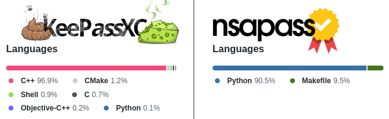

<p align="center">
    
</p>

# What is _nsapass_?
Generally, it is the simplest, most usable, most secure, passwords manager.
Because all other password managers are either too complex to be
audit-able, lack critical features, or both.

## Quick comparison

- [_keepassxc_](https://github.com/keepassxreboot/keepassxc) has loads of
  lines of codes that makes it effectively not audit-able, and it's CLI is
  terrible.  So it loses on both of the auditability and usability
  dimensions.
- [_pass_](https://www.passwordstore.org/) has roughly about the same lines
  of codes as _nsapass_, so it is sort of auditable, but it:
  - Exposes each password entry as a file with a meaningful name (so that
    the user remembers it).  The file names are obviously in plain text in
    the file system.  If file names are relevant to passwords inside them,
    then it leaks information should the disk be stolen.  If the file names
    are not relevant, then it becomes not usable as you'll need to remember
    odd names unrelated to passwords within them.

    _nsapass_ doesn't leak any information about the
    entries, as the whole database is stored in a single encrypted file.
    You will be free to choose the most memorable method to tag your entry,
    without conerns of leaking it in plain text in the file system.

  - Is limited to `gpg` for file encryption and decryption, a bloated tool.

    _nsapass_ allows you to use any other file encryption and decryption
    tool.

  - Lots of limitations:
    - E.g. _pass_'s password generation isn't able to generate desired
      passwords based on target entropy bits (at least not out of the box).

      _nsapass_ does this neatly with the `-b BITS` argument.

    - E.g. _pass_ uses the directory stricture offered by the file system
      ro organise entries.  This requires too much typing to identify.

      _nsapass_ uses a smart tagging system that can
      effectively achieve a heirarichal partitioning of entries, without
      needing to type their names fully.  E.g. you may even skip tags in
      the middle; something you cannot do with _pass_'s directory
      structure.

    - ...

  So, when considering the limited features of _pass_ compared to those of
  _nsapass_, _pass_ rather feels very bloated; _nsapass_ does much more
  with about the same size of about `800` lines of code.

## A closer look

- **No funny memory bugs:** Thanks implementing _nsapass_
  entirely in Python, we easily win this by simply taking advantage of the
  decades already spent by Python's many highly-skilled monkeys in fighting
  all sorts of funny memory bugs and security issues.

- **Easy to audit:** _nsapass_ is just a single file, in about `800`
  lines of code, including its configurations.  This makes it actually
  auditable in a practical manner.

  Auditability of a password manager is extremely critical and must be a
  fundamental requirement.  Compare this to the countless
  practically-unauditable C/C++ lines in the likes of
  [_keepassxc_](https://github.com/keepassxreboot/keepassxc) (yikes!).
  Would you entrust your passwords to them?  I would not, henceforth
  _nsapass_.

- **Very powerful:** _nsapass_ is simple, but not stupidly.  It allows you
  to define your own external commands for encrypting, decrypting or doing
  whatever you want with your retrieved passwords/keyfiles/URIs entries, by
  simply editing configuration variables `ENCRYPT_COMMAND`,
  `DECRYPT_COMMAND`, `DO_COMMANDS` which are inside `nsa` script itself.

  This allows for neat automations.  The argument `-c` allows to define a
  sequence of actions.  E.g. with default `DO_COMMANDS`, `nsa do caveman -c
  pod` will 1st load the password into clipboard (`p`), paste it by
  emulating `Ctrl+V` (`o`), and then deleting the password in the clipboard
  (`d`).  

  You can define your own automations, with your own magical external
  commands.  E.g. you may even skip the clipboard and do it entirely using
  keyboard emulation?  Your imagination is the limit!

- **Less password typing:** First you load your passwords database into an
  _nsapass_ backend by`nsa start`, and then enjoy using it without password
  prompts by commands such a `nsa ls ...`, `nsa add ...`, etc.  `nsa -h`
  for details.

  This not only enhances the convenience, but is necessary to practically
  increase our security, as password databases must be encrypted by
  high-entropy passwords that are _rarely_ typed.  Minimising moments when
  we type such high-entropy password reduces password theft windows (e.g.
  look-behind-shoulder).

- **Smart tags-based search for minimal typing:**  All password entries are
  stored with tags.  You don't have to fully type a tag's name.  _nsapass_
  has a smart tags lookup system.

  E.g. if you'd like to pick the entry associated with the tags `caveman
  protonmail`, you may identify it the boring way by `nsa do caveman protonmail`, or by
  just typing `nsa do c p` if it's the only entry with tags that begin with
  `c` and `p`.  _nsapass_ will intelligently figure out that `c p` must
  have been referring to `caveman protonmail`, based on how unique the
  match is against tags of other entries in the database..

- **Common sense:** Your passwords database never touches the disk in plain
  text form.  If you have disk swap memory, or cybernation, make sure
  they're encrypted (or disable them; who needs them these days?).

- **Looks pretty:**

<p align="center"></p>
<p align="center"><strong>Fig 1.</strong> Initial setup.</p>
    
<p align="center"></p>
<p align="center"><strong>Fig 2.</strong> Some use.</p>

# Usage

## Installation

1. **Optional:** Edit file `nsa` to apply your configurations.
1. Paste the file `nsa` in wherever you'd like it to be.  Perhaps somewhere
   in `PATH`.
1. **Optional:** For convenient pasting of username and passwords, perhaps
   add some shortcuts to your window manager.  These are shortcuts that I
   use for my `i3`:

   ```
   bindsym $mod+i exec nsa stop
   bindsym --release $mod+comma exec nsa do -c uod
   bindsym --release $mod+period exec nsa do -c pod
   ```

   The command `nsa do -c uod` is an automation that loads the username into
   the clipboard (`u`), pastes it by emulating `Control+V` (`o`), then deletes
   the password from clipboard (`d`).  The other command `nsa do -c uod` does
   the same except for the password.

   You can add your own other commands against those fields, as well as others
   such as URI and stored binary key files.

## How I use _nsapass_

### Database creation and housekeeping
1. `nsa create` to create an empty database.  This is done only once.
1. `nsa start` and type my high-entropy password to let _nsapass_'s backend
   run in some window terminal, and keep it running there.
1. Suppose that I'd like to add a new password entry for my _ProtonMail_
   account, I open a new terminal and do:

   `nsa add -t caveman protonmail -b 256 -r https://protonmail.com`

   This will create a password with `256`bits of entropy, from the default
   set of printable characters (customisable; see `-p` and `-o`), and a
   couple of tags `paveman protonmail` for later retrieval.
1. To save this entry, I:
    1. Inspect it by `nsa diff`.  If I'd like to actually see the password,
       I add the `-z` flag, i.e. `nsa diff -z`.
    2. `nsa commit`.
1. If i'm unhappy about what I see in `nsa diff`, I can modify it by
   `nsa mod ...` (see `nsa mod -h`), delete it by `nsa del c p` (see `nsa
   del -h`), or delete all scheduled changes by `nsa revert` (see `nsa
   revert -h`).

### Logging into things

1. I retrieve it by `nsa do caveman protonmail` (or just `nsa do c p`
   if the tags are unique enough, as _nsapass_ is smart to figure out
   what you meant).  I usually type this command using `rofi`, `dmenu`,
   etc, for maximum convenience.
1. I go to my browser where _ProtonMail_'s login prompt is displaying,
   and hit shortcut `$mod+comma`, which will paste the username for me.
1. Press tab to move to the password field.
1. Press `$mod+period` to paste the `256` entropy-bit password.

# Dependencies

- Python.
- Any file encryption and decryption tool of your choice (as long as it can
  read passwords and plaintext input as STDIN, and write ciphertext output
  as STDOUT).

  By default [`ciphart`](https://github.com/Al-Caveman/ciphart) is used.
- Any external commands to do whatever you want with your entries.

  By default [`xclip`](https://github.com/astrand/xclip) and
  [`xdotool`](http://www.semicomplete.com/projects/xdotool) are used for
  clipboard management and keyboard emulations, respectively.

# Manual

```
usage: nsa [-h] [-v] [-V] [-C] [-i DIR]
           {create,chpass,start,stop,do,add,del,mod,ls,diff,commit,revert} ...

optional arguments:
  -h, --help            show this help message and exit
  -v                    show information about nsapass
  -V                    show debugging information
  -C                    disable colourful output
  -i DIR                ipc directory

commands:
  {create,chpass,start,stop,do,add,del,mod,ls,diff,commit,revert}
    create              create a databases
    chpass              change databases's password
    start               starts nsapass
    stop                stops nsapass and discards any uncommitted changes
    do                  do things (e.g. type passwords)
    add                 add an entry
    del                 delete an entry
    mod                 modify an entry
    ls                  view entries
    diff                show modifications done so far
    commit              commit changes to the database
    revert              revert all uncommitted changed back to original
```
```
usage: nsa create [-h] [-d DB] [-s]

optional arguments:
  -h, --help  show this help message and exit
  -d DB       set passwords database path
  -s          input from stdin
```
```
usage: nsa chpass [-h] [-s]

optional arguments:
  -h, --help  show this help message and exit
  -s          input from stdin
```
```
usage: nsa start [-h] [-s] [-d DB]

optional arguments:
  -h, --help  show this help message and exit
  -s          input from stdin
  -d DB       set passwords database path
```
```
usage: nsa stop [-h] [-s]

optional arguments:
  -h, --help  show this help message and exit
  -s          input from stdin
```
```
usage: nsa do [-h] [-s] [-c COMMANDS] [QUERY ...]

positional arguments:
  QUERY        query tags

optional arguments:
  -h, --help   show this help message and exit
  -s           input from stdin
  -c COMMANDS  perform actions specified in COMMANDS in order from left to
               right. COMMANDS can be a string made of characters defined in
               DO_COMMANDS. e.g. `nsa do caveman protonmail -c uod` copies the
               username associated with the 'caveman protonmail' tags into the
               selection buffer, pastes it, then deletes it from the selection
               buffer.
```
```
usage: nsa add [-h] [-t TAG [TAG ...]] [-u USERNAME] [-p SET] [-o LETTERS]
               [-b BIT] [-l LEN] [-m] [-f PATH] [-r URI] [-n NOTE] [-s] [-z]

optional arguments:
  -h, --help        show this help message and exit
  -t TAG [TAG ...]  new tags
  -u USERNAME       new username
  -p SET            pre-defined password letters set name
  -o LETTERS        raw password letter options
  -b BIT            generate BIT-entropy password from SET
  -l LEN            generate LEN-long password from SET
  -m                user-defined password
  -f PATH           key/data file in PATH, or STDIN if "-"
  -r URI            a uniform resource identifier
  -n NOTE           a note
  -s                input from stdin
  -z                show passwords
```
```
usage: nsa del [-h] [-s] [-z] [QUERY ...]

positional arguments:
  QUERY       query tags

optional arguments:
  -h, --help  show this help message and exit
  -s          input from stdin
  -z          show passwords
```
```
usage: nsa mod [-h] [-t TAG [TAG ...]] [-u USERNAME] [-p SET] [-o LETTERS]
               [-b BIT] [-l LEN] [-m] [-f PATH] [-r URI] [-n NOTE] [-s] [-z]
               [QUERY ...]

positional arguments:
  QUERY             query tags

optional arguments:
  -h, --help        show this help message and exit
  -t TAG [TAG ...]  new tags
  -u USERNAME       new username
  -p SET            pre-defined password letters set name
  -o LETTERS        raw password letter options
  -b BIT            generate BIT-entropy password from SET
  -l LEN            generate LEN-long password from SET
  -m                user-defined password
  -f PATH           key/data file in PATH, or STDIN if "-"
  -r URI            a uniform resource identifier
  -n NOTE           a note
  -s                input from stdin
  -z                show passwords
```
```
usage: nsa ls [-h] [-s] [-z] [QUERY ...]

positional arguments:
  QUERY       query tags

optional arguments:
  -h, --help  show this help message and exit
  -s          input from stdin
  -z          show passwords
```
```
usage: nsa diff [-h] [-s] [-z]

optional arguments:
  -h, --help  show this help message and exit
  -s          input from stdin
  -z          show passwords
```
```
usage: nsa commit [-h] [-s] [-d DB]

optional arguments:
  -h, --help  show this help message and exit
  -s          input from stdin
  -d DB       set passwords database path
```
```
usage: nsa revert [-h] [-s]

optional arguments:
  -h, --help  show this help message and exit
  -s          input from stdin
```

# Contact

- Web: https://github.com/Al-Caveman/nsapass
