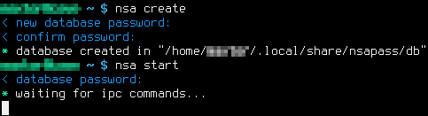

# Synopsis
_nsapass_ is the simplest, most usable and most secure
[CLI](https://en.wikipedia.org/wiki/Command-line_interface) passwords
manager for GNU/Linux.  Because all other password managers are either too
complex to be audit-able, lack critical features, or both.

<p align="center"></p>
<p align="center"><strong>Fig 1.</strong> Initial setup.</p>

<p align="center"></p>
<p align="center"><strong>Fig 2.</strong> Some use.</p>

## Features

- **No funny memory bugs:** Thanks implementing _nsapass_
  entirely in Python, we easily win this by simply taking advantage of the
  decades already spent by Python's many highly-skilled monkeys in fighting
  all sorts of funny memory bugs and security issues.

- **Easy to audit:** _nsapass_ is just a single file, in about `800`
  lines of code, including its configurations.  This makes it actually
  auditable in a practical manner.

  Auditability of a password manager is extremely critical and must be a
  fundamental requirement.  Compare this to the countless
  practically-unauditable C/C++ lines in the likes of
  [_keepassxc_](https://github.com/keepassxreboot/keepassxc) (yikes!).
  Would you entrust your passwords to them?  I would not, henceforth
  _nsapass_.

- **Very powerful:** _nsapass_ is simple, but not stupidly.  It allows you
  to define your own external commands for encrypting, decrypting or doing
  whatever you want with your retrieved passwords/keyfiles/URIs entries, by
  simply editing configuration variables `ENCRYPT_COMMAND`,
  `DECRYPT_COMMAND`, `DO_COMMANDS` which are inside `nsa` script itself.

  This allows for neat automations.  The argument `-c` allows to define a
  sequence of actions.  E.g. with default `DO_COMMANDS`, `nsa do caveman -c
  copypass paste delclip` will 1st load the password into clipboard, paste
  it by emulating `Ctrl+V`, and then deleting the password in the
  clipboard.

  You can define your own automations, with your own magical external
  commands.  E.g. you may even skip the clipboard and do it entirely using
  keyboard emulation?  Your imagination is the limit!

- **Less password typing:** First you load your passwords database into an
  _nsapass_ backend by`nsa start`, and then enjoy using it without password
  prompts by commands such a `nsa ls ...`, `nsa add ...`, etc.  `nsa -h`
  for details.

  This not only enhances the convenience, but is necessary to practically
  increase our security, as password databases must be encrypted by
  high-entropy passwords that are _rarely_ typed.  Minimising moments when
  we type such high-entropy password reduces password theft windows (e.g.
  look-behind-shoulder).

- **Smart tags-based search for minimal typing:**  All password entries are
  stored with tags.  You don't have to fully type a tag's name.  _nsapass_
  has a smart tags lookup system.

  E.g. if you'd like to pick the entry associated with the tags `caveman
  protonmail`, you may identify it the boring way by `nsa do caveman protonmail`, or by
  just typing `nsa do c p` if it's the only entry with tags that begin with
  `c` and `p`.  _nsapass_ will intelligently figure out that `c p` must
  have been referring to `caveman protonmail`, based on how unique the
  match is against tags of other entries in the database..

- **Common sense:** Your passwords database never touches the disk in plain
  text form.  If you have disk swap memory, or cybernation, make sure
  they're encrypted (or disable them; who needs them these days?).

## A comparison

- [_keepassxc_](https://github.com/keepassxreboot/keepassxc) has loads of
  lines of codes that makes it effectively not audit-able, and it's CLI is
  terrible.  So it loses on both of the auditability and usability
  dimensions.
- [_pass_](https://www.passwordstore.org/) has roughly about the same lines
  of codes as _nsapass_, so it is sort of auditable, but it:
  - Exposes each password entry as a file with a meaningful name (so that
    the user remembers it).  The file names are obviously in plain text in
    the file system.  If file names are relevant to passwords inside them,
    then it leaks information should the disk be stolen.  If the file names
    are not relevant, then it becomes not usable as you'll need to remember
    odd names unrelated to passwords within them.

    _nsapass_ doesn't leak any information about the
    entries, as the whole database is stored in a single encrypted file.
    You will be free to choose the most memorable method to tag your entry,
    without conerns of leaking it in plain text in the file system.

  - Is limited to `gpg` for file encryption and decryption; a bloated tool.

    _nsapass_ not only allows you to use any file encryption and decryption
    tool of your choice, but also any key derivation function.

  - Lots of limitations:
    - E.g. _pass_'s password generation isn't able to generate desired
      passwords based on target entropy bits (at least not out of the box).

      _nsapass_ does this neatly with the `-b BITS` argument.

    - E.g. _pass_ uses the directory structure offered by the file system
      to organise its passwords.  This requires too much typing to
      identify a given password.  E.g. suppose that a password entry is
      stored in `path/to/foo/.../baz` and suppose that the entry is already
      made unique by `path/.../baz`, you will still need to type
      `path/to/foo/../baz` entirely.  Why not just type `path baz` and let
      it figure out that you meant that?  No good reason.

      _nsapass_ uses a smart tagging system that can effectively achieve
      that heirarichal partitioning of entries, without needing to type
      their names fully.  E.g. in the example above, you can retrieve that
      entry by not only typing `path baz` (which is already great), but
      even by simply typing `p b` if those partial tags make the full tags
      unique already.

    - ...

  So, when considering the limited features of _pass_ compared to those of
  _nsapass_, _pass_ rather feels very bloated; _nsapass_ does much more
  with about the same size of about `800` lines of code.

# Installation

1. **Optional:** Edit file `nsa` to apply your configurations.
1. Paste the file `nsa` in wherever you'd like it to be.  Perhaps somewhere
   in `PATH`.

# Tutorial

## Database creation and housekeeping
1. `nsa create` to create an empty database.  This is done only once.
1. `nsa start` will load the nsapass server.
1. In a separate terminal, use commands `nsa (ls | add | del | mod | diff |
   commit | revert)` to modify the passwords database.  Here is an example:
   1. `nsa add -t caveman protonmail -b 256` will
      add an automatically generated password worth `256` many Shannon's
      entropy bits for my _ProtonMail_ account, using the default
      characters space (`printable`), and associates it with the tags
      `caveman protonmail` for convenient retrieval in the future.
   1. `nsa diff` will view the total changes made so far to the passwords
      database.
   1. If changes are not fine, undo them by `nsa del caveman
      protonmail`, or `nsa revert`.  The latter will reset the database to
      latest committed version.
   1. If changes are are good, then save them by `nsa commit`.  Saving them
      is necessary to make the changes permanent.
   1. When no longer in need of _nsapass_, execute `nsa stop` to stop the
      server.

## An example of convenient use

I've added these shortcuts to my `i3` window manager:
```
bindsym           $mod+i       exec nsa do -c delclip
bindsym --release $mod+comma   exec nsa do -c copyuser
bindsym --release $mod+period  exec nsa do -c copypass
bindsym --release $mod+g       exec nsa do -c sleep copypass paste delclip enter
bindsym --release $mod+shift+g exec nsa do -c sleep copyuser paste delclip enter copypass paste delclip enter
```

Suppose that I'd like use entries that associate with the tags `EXAMPLE TAGS`.
I perform these in order:

1. I start the _nsapass_ server in some terminal by `nsa start`, and let it
   run there for as long as I want to access my passwords database.
1. I execute `nsa do EXAMPLE TAGS` (or just `nsa do E` if partial tags
   query `c p` uniquely identifies tags `EXAMPLE TAGS`) in order to load
   the entry.
1. Then I use the username, password or keyfile entries depending on the
   way the application works.
   - For general applications, I load username and password entries into
     the clipboard by `$mod+comma` and `$mod+period`, respectively, then
     paste them by `control+v`.  I finally delete them by `$mod+i`.
   - For CLI applications that have a well defined order of prompts, such
     as `git`, I use `$mod+shift+g` to have _nsapass_ automatically
     copy-paste-delete username and password entries, successively, using a
     single shortcut.
   - For CLI applications that only need the password, such as `ssh
     user@server`, I use `$mod+g` which only copy-pastes-deletes the
     password.


It should be also possible to (but I personally don't do it this way):

- Make it even more convenient, by configuring shortcuts with GUI prompts,
  that take advantage of the fact that steps `nsa do EXAMPLE TAGS` and,
  say, `nsa do -c copyuser` can be combined in a single step `nsa do
  EXAMPLE TAGS -c copyuser`.
- Automate command execution.  E.g. command `z` could be defined in such a
  way that `nsa do EXAMPLE TAGS -c z ...` would execute `git push` and feed
  it with passwords as earlier.

# Dependencies

- Python.
- Any key derivation function tool.  Default:
  [`argon2`](https://github.com/p-h-c/phc-winner-argon2).
- Any file encryption and decryption tool.  Default:
  [`openssl`](https://www.openssl.org/).
- Any external commands to do whatever you want with your entries.
  Default: [`xclip`](https://github.com/astrand/xclip) and
  [`xdotool`](http://www.semicomplete.com/projects/xdotool) for clipboard
  management and keyboard emulation, respectively.

# Manual

```
usage: nsa [-h] [-v] [-V] [-C] [-i DIR]
           {create,chpass,start,stop,do,add,del,mod,ls,diff,commit,revert} ...

optional arguments:
  -h, --help            show this help message and exit
  -v                    show information about nsapass
  -V                    show debugging information
  -C                    disable colourful output
  -i DIR                ipc directory

commands:
  {create,chpass,start,stop,do,add,del,mod,ls,diff,commit,revert}
    create              create a databases
    chpass              change databases's password
    start               starts nsapass
    stop                stops nsapass and discards any uncommitted changes
    do                  do things (e.g. type passwords)
    add                 add an entry
    del                 delete an entry
    mod                 modify an entry
    ls                  view entries
    diff                show modifications done so far
    commit              commit changes to the database
    revert              revert all uncommitted changed back to original
```
```
usage: nsa create [-h] [-d DB] [-s]

optional arguments:
  -h, --help  show this help message and exit
  -d DB       set passwords database path
  -s          input from stdin
```
```
usage: nsa chpass [-h] [-s]

optional arguments:
  -h, --help  show this help message and exit
  -s          input from stdin
```
```
usage: nsa start [-h] [-s] [-d DB]

optional arguments:
  -h, --help  show this help message and exit
  -s          input from stdin
  -d DB       set passwords database path
```
```
usage: nsa stop [-h] [-s]

optional arguments:
  -h, --help  show this help message and exit
  -s          input from stdin
```
```
usage: nsa do [-h] [-s] [-c COMMANDS [COMMANDS ...]] [QUERY ...]

positional arguments:
  QUERY                 query tags

optional arguments:
  -h, --help            show this help message and exit
  -s                    input from stdin
  -c COMMANDS [COMMANDS ...]
                        perform actions specified in COMMANDS in order from
                        left to right. COMMANDS are defined in option
                        DO_COMMANDS, which currently are: copyuser, copypass,
                        copyuri, delclip, paste, enter, keyfile, sleep
```
```
usage: nsa add [-h] [-t TAG [TAG ...]] [-u USERNAME] [-p SET] [-o LETTERS]
               [-b BIT] [-l LEN] [-m] [-f PATH] [-r URI] [-n NOTE] [-s] [-z]

optional arguments:
  -h, --help        show this help message and exit
  -t TAG [TAG ...]  new tags
  -u USERNAME       new username
  -p SET            pre-defined password letters set name
  -o LETTERS        raw password letter options
  -b BIT            generate BIT-entropy password from SET
  -l LEN            generate LEN-long password from SET
  -m                user-defined password
  -f PATH           key/data file in PATH, or STDIN if "-"
  -r URI            a uniform resource identifier
  -n NOTE           a note
  -s                input from stdin
  -z                show passwords
```
```
usage: nsa del [-h] [-s] [-z] [QUERY ...]

positional arguments:
  QUERY       query tags

optional arguments:
  -h, --help  show this help message and exit
  -s          input from stdin
  -z          show passwords
```
```
usage: nsa mod [-h] [-t TAG [TAG ...]] [-u USERNAME] [-p SET] [-o LETTERS]
               [-b BIT] [-l LEN] [-m] [-f PATH] [-r URI] [-n NOTE] [-s] [-z]
               [QUERY ...]

positional arguments:
  QUERY             query tags

optional arguments:
  -h, --help        show this help message and exit
  -t TAG [TAG ...]  new tags
  -u USERNAME       new username
  -p SET            pre-defined password letters set name
  -o LETTERS        raw password letter options
  -b BIT            generate BIT-entropy password from SET
  -l LEN            generate LEN-long password from SET
  -m                user-defined password
  -f PATH           key/data file in PATH, or STDIN if "-"
  -r URI            a uniform resource identifier
  -n NOTE           a note
  -s                input from stdin
  -z                show passwords
```
```
usage: nsa ls [-h] [-s] [-z] [QUERY ...]

positional arguments:
  QUERY       query tags

optional arguments:
  -h, --help  show this help message and exit
  -s          input from stdin
  -z          show passwords
```
```
usage: nsa diff [-h] [-s] [-z]

optional arguments:
  -h, --help  show this help message and exit
  -s          input from stdin
  -z          show passwords
```
```
usage: nsa commit [-h] [-s] [-d DB]

optional arguments:
  -h, --help  show this help message and exit
  -s          input from stdin
  -d DB       set passwords database path
```
```
usage: nsa revert [-h] [-s]

optional arguments:
  -h, --help  show this help message and exit
  -s          input from stdin
```

# Contact

- Web: https://github.com/Al-Caveman/nsapass
